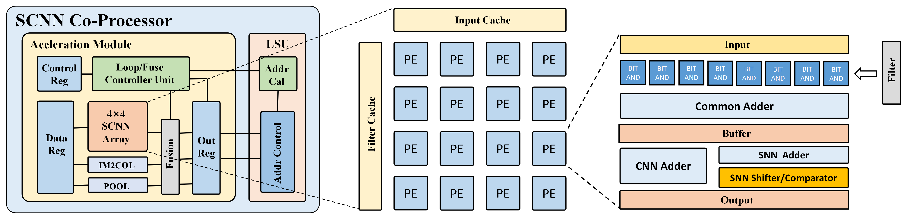

# ___RV-SCNN Processor___
  
  
  This work is based on OpenHW Group CV32E40P.

* ## Directories:
  **core-v-verif:**  Verification Environment 
  **rv-scnn_rtl:**   RTL source code of the RV-SCNN 
  **rv-scnn_test:**  C code for custom instrctions test of RV-SCNN 

* ## Introduction
   
  

RV-SCNN Architecture

  We have designed a RISC-V based processor – RV-SCNN, with customized instruction set for CNN and SNN Inference Acceleration. The RV-SCNN ISA incorporates multiple customized SIMD (Single Instruction Multiple Data) instructions to accelerate SNN and CNN inference computation, along with optimized memory allocation and access schemes. The benefits and impacts of the processor have been verified on various SNN and CNN image recognition tasks. The main contributions of this work are as follows:

    * The most commonly used operations in CNN/SNN computation, such as matrix multiplication, convolution, pooling,etc., are all optimized into SIMD instructions.

    * SNN and CNN matrix multiplication operations have dedicated hardware modules, and can be multiplexed through instruction settings, thus reducing hardware switching overhead.

    * A dedicated IM2COL(Image To Column) hardware unit is implemented for convolutions between a 4×4 input matrix and a 3×3 filter, with optimized memory allocation and
    accessing scheme.

    * The RV-SCNN processor also incorporates a loop control unit and an address calculation unit, which greatly reduces the overhead of frequent address calculations, and requires much less number of instructions.

    * In order to reduce the redundant and repeated data write-back and retrieval between adjacent layers in CNN/SNN, a layer fusion strategy is implemented, where instructions that operate on the same data in adjacent layers can be fused in one batch. This strategy greatly reduces the memory access overheads.

* ## Custom Instructions
* ### L_MODE
  **RS1**: Set SNN or CNN Operation. Set GEMM or Convolution Operation. The Index of Bias.  
  **RS2**: Bias of SNN or CNN operation.  
  | instr   | funct7  |  rs2 |  rs1 | func3 | rd   | opcode |
  | :-------: | :-------: | :----: | :----: | :----: | :-----: | :------: |
  | L_MODE | 0000100 | bias | mode | 010  | \ | 0x77 |

* ### L_SCNN
  **RS1**: K Dimension of GEMM. Input Channel of Convolution. Vth and Shifter of SNN.  
  **RS2**: M and N Dimension of GEMM. Input Side of Convolution.  
  | instr   | funct7  |  rs2 |  rs1 | func3 | rd   | opcode |
  | :-------: | :-------: | :----: | :----: | :----: | :-----: | :------: |
  | L_SCNN | 0000000 | M/N/Inside | K/Chn/Vth/shift | 000  | \ | 0x77 |

* ### SCNN4x4
  **RS1**: Header Address of Matrix A or Header Address of Convolution Input in Memory. 
  **RS2**: Header Address of Matrix B or Header Address of Convolution Filter in Memory  
  | instr   | funct7  |  rs2 |  rs1 | func3 | rd   | opcode |
  | :-------: | :-------: | :----: | :----: | :----: | :-----: | :------: |
  | SCNN4x4 | 0000001 | addrB | addrA | 000  | \ | 0x77 |

* ### SCNN_WB
  **RS1**: Header Address of Output Matrix in Memory.  
  | instr   | funct7  |  rs2 |  rs1 | func3 | rd   | opcode |
  | :-------: | :-------: | :----: | :----: | :----: | :-----: | :------: |
  | SCNN_WB | 0000010 | \ | addr_out | 000  | \ | 0x77 |

* ### POOL_RI
  **RS1**: Header Address of Pool Data in Memory. 
  | instr   | funct7  |  rs2 |  rs1 | func3 | rd   | opcode |
  | :-------: | :-------: | :----: | :----: | :----: | :-----: | :------: |
  | POOL_RI | 0000000 | \ | addr_in | 010  | \ | 0x77 |

* ### POOL
  **RS1**: Set the Pooling Mode of SNN or CNN. 
  | instr   | funct7  |  rs2 |  rs1 | func3 | rd   | opcode |
  | :-------: | :-------: | :----: | :----: | :----: | :-----: | :------: |
  | POOL | 0000001 | \ | mode | 010  | \ | 0x77 |

* ### POOL_WB
  **RS1**: Header Address of Pooling Result in Memory. 
  **RS2**: Index of Pooling Result. 
  | instr   | funct7  |  rs2 |  rs1 | func3 | rd   | opcode |
  | :-------: | :-------: | :----: | :----: | :----: | :-----: | :------: |
  | POOL_WB | 0000010 | index | addr_out | 010  | \ | 0x77 |

  